# Library Book Manager Web app 


## Prerequiste.
- React Js
- Reactstrap / Bootstrap
- npm (node module Package)
- Redux (for managemant state)

## Installation
### Clone
```
$ git clone https://github.com/rizkigumilar/Frontend-libraryApp.git
$ cd Frontend-libraryApp
$ npm install
```

### Start Development Server
```
$ npm start
```

### Demo application


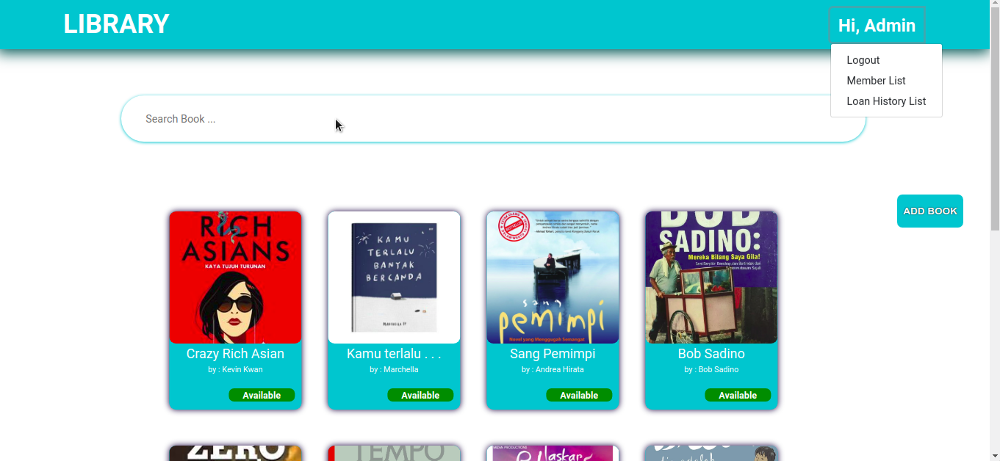
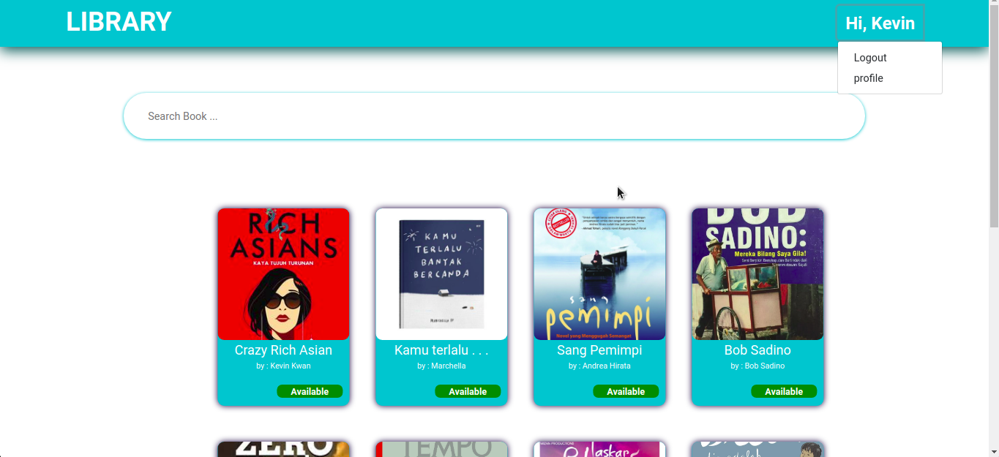
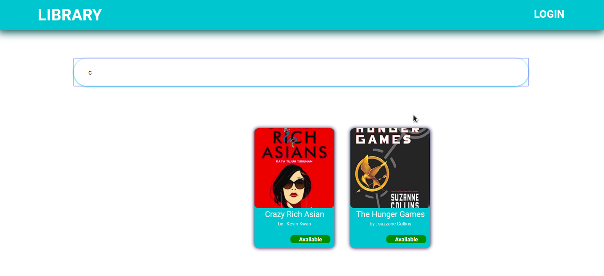
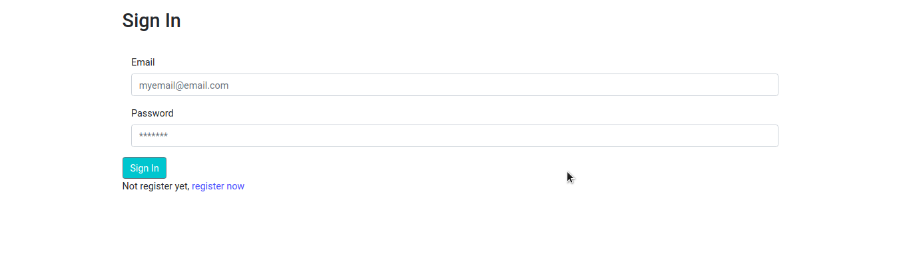
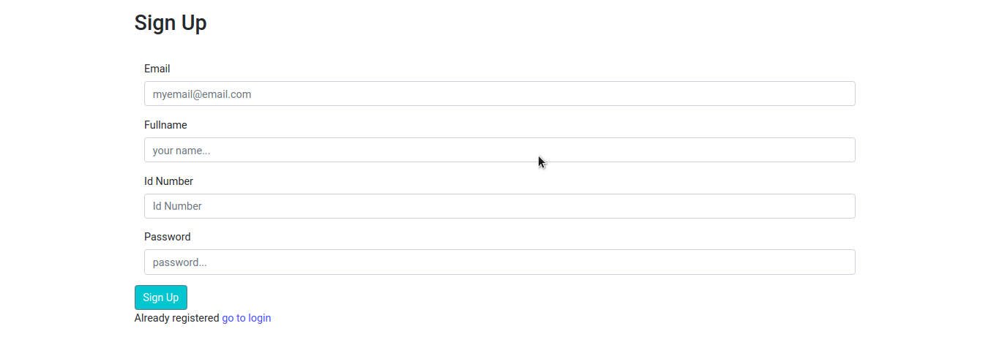

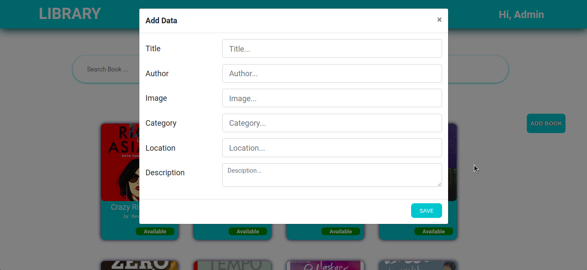
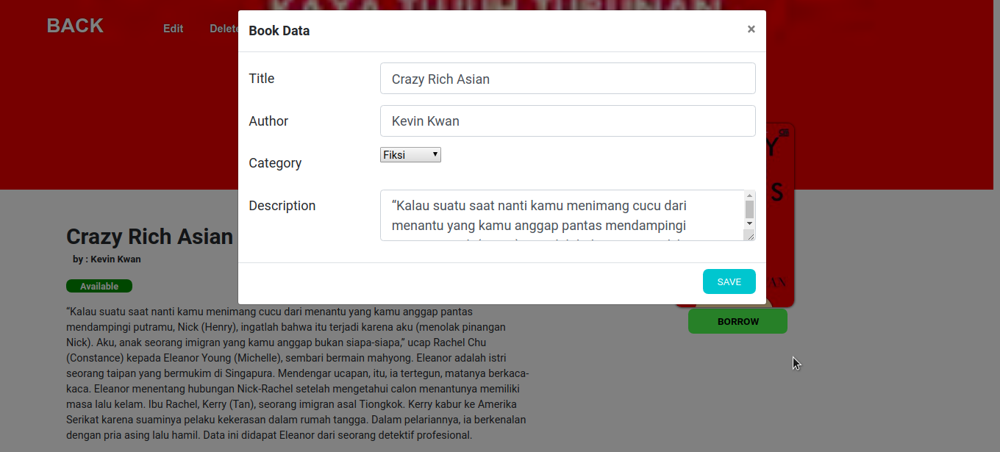
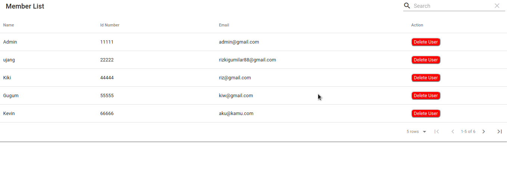
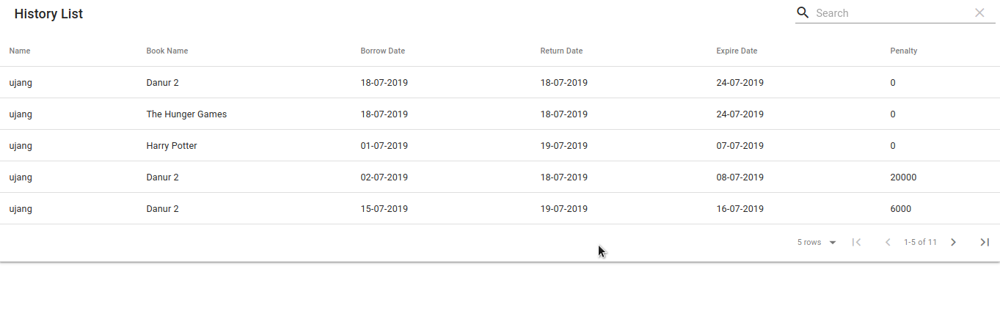
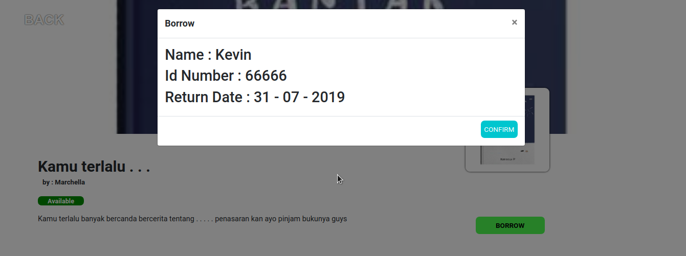
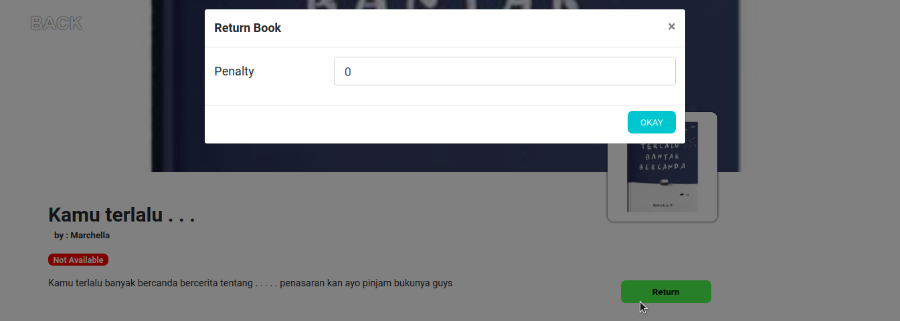


# Happy Coding Guys !!!


